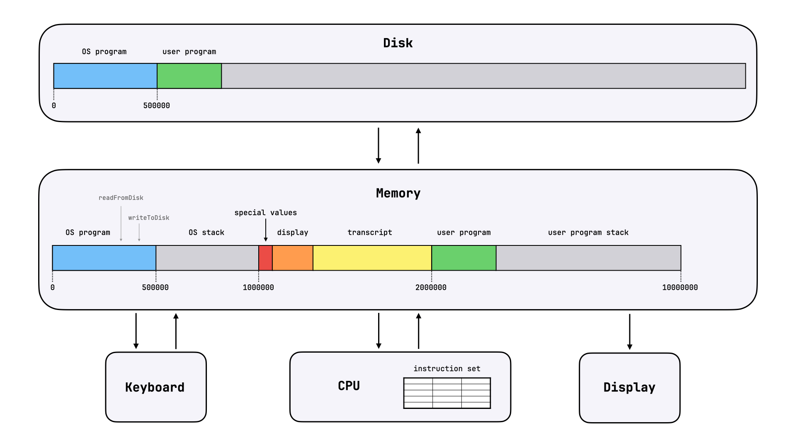
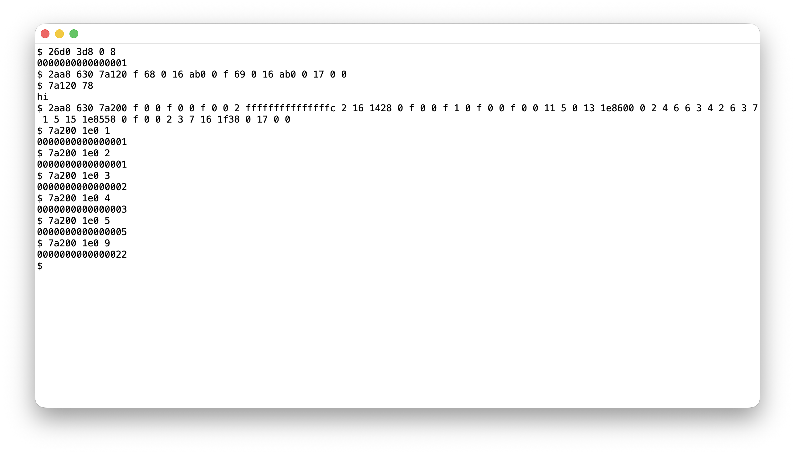

# Computer From Scratch



A minimal simulated computer implemented from scratch in Python (`computer.py`), plus a minimal operating system in ~600 lines of machine code (`os.txt`).

The operating system runs a simple command-line loop: it listens for keyboard input, interprets it as a program invocation, runs that program, and then listens for the next input. You run a program, get a result, run another program, get another result, and so on. This simple setup removes a great deal of complexity that real-world operating systems need to have. There are no processes. No threads. No scheduling. No concurrency. No locks. No race conditions. No page tables. No virtual memory. No privilege levels. No system calls. No device drivers. No programming languages. No compilers.

See [demo.mov](demo.mov) for how this computer can be used. Running `python computer.py` will open a window that simulates the display of this computer, and you can use your keyboard to simulate keyboard input. Programs are invoked by typing something like `26d0 3d8 0 8` and Enter, which means "run the program stored at address `26d0` on disk, spanning `3d8` bytes, with two input values: `0` and `8`" (numbers are written in hex). At first, the only programs are `readFromDiskProgram(diskAddress, numBytes)` and `writeToDiskProgram(diskAddress, values...)`, but you can use the write program to write new programs to disk. In the demo, I first run the read program to read the first 8 bytes from disk, then write a new program that prints `hi` and invoke it, and finally write a new program that computes the n-th Fibonacci number and invoke it with `n=1`, `n=2`, `n=3`, `n=4`, `n=5`, and `n=9` (e.g., `n=9` outputs `22`, which is `34` in hex).



## What Is a Computer?

This computer consists of 5 basic components: memory, CPU, disk, keyboard, and display.

Memory is the component that stores values while the computer is powered on. It is organized as an array of bytes and allows read and write operations at any address. In this computer, memory is `10000000` bytes long.

CPU is the component that performs operations on memory values. The set of supported operations, or "machine instructions", is fixed ahead of time, and the CPU has hard-wired circuits implementing each of them. The CPU interprets memory values as instructions and executes them one by one until powered off. At each clock cycle, it looks up the instruction pointer (a special 8-byte value at address `1000000` that stores the address of the next instruction), fetches the next instruction, executes it, and updates the instruction pointer. To store local variables, the CPU uses a dedicated "stack" space in memory where values are pushed and popped. The base pointer (a special 8-byte value at address `1000008`) stores where the current function's stack space starts, and the stack pointer (a special 8-byte value at address `1000016`) stores where it ends. Many instructions operate on slots, where `slot(n)` is the 8-byte value at `basePointer + n * 8`. By convention, `slot(0)`, `slot(1)`, ... are used for local variables, and `slot(-3)`, `slot(-4)`, ... are used for function arguments and return values (`slot(-1)` and `slot(-2)` are reserved for the old base pointer and return address). Each instruction is encoded as 24 bytes: 8 for the opcode, 8 for the first operand, and 8 for the second operand, padded with 0s for unused operands. Here is the full instruction set used in this computer:

| Opcode | Instruction | Effect |
| --- | --- | --- |
| `0` | `idle` | Do nothing and keep instruction pointer unchanged. |
| `1` | `moveNumberToAddress 27 123456` | `memory[123456] = 27` |
| `2` | `move 4 5` | `slot(5) = slot(4)` |
| `3` | `moveNumber 27 3` | `slot(3) = 27` |
| `4` | `moveFromPointer 3 4` | `slot(4) = memory[slot(3)]` |
| `5` | `moveToPointer 3 4` | `memory[slot(4)] = slot(3)` |
| `6` | `add 3 4` | `slot(4) = slot(4) + slot(3)` |
| `7` | `addNumber 27 3` | `slot(3) = slot(3) + 27` |
| `8` | `subtract 3 4` | `slot(4) = slot(4) - slot(3)` |
| `9` | `shiftLeft 3 4` | `slot(4) = slot(4) << slot(3)` |
| `10` | `shiftLeftByNumber 27 4` | `slot(4) = slot(4) << 27` |
| `11` | `shiftRight 3 4` | `slot(4) = slot(4) >> slot(3)` |
| `12` | `shiftRightByNumber 27 4` | `slot(4) = slot(4) >> 27` |
| `13` | `bitwiseAnd 3 4` | `slot(4) = slot(4) & slot(3)` |
| `14` | `bitwiseAndWithNumber 15 4` | `slot(4) = slot(4) & 15` |
| `15` | `pushNumber 27` | Push `27` to the stack. |
| `16` | `pop` | Move the stack top back by one slot. |
| `17` | `compare 3 4` | Compare `slot(3)` to `slot(4)` and set ALU flags. |
| `18` | `compareToNumber 3 67` | Compare `slot(3)` to `67` and set ALU flags. |
| `19` | `jumpIfEqual 4000000` | Jump if the equal flag is set. |
| `20` | `jumpIfGreater 4000000` | Jump if the greater flag is set. |
| `21` | `jump 4000000` | Jump unconditionally. |
| `22` | `call 4000000` | Push return address and old base pointer, set a new base pointer, then jump. |
| `23` | `return` | Restore stack top, base pointer, and instruction pointer. |

Disk is the component that stores values persistently. Like memory, it is an array of bytes that supports reads and writes at any address, but it keeps its values when unplugged. Disk interaction happens through a contract based on special memory locations. To read from disk, write the disk address to `1000024`, the memory address (where to write the result) to `1000032`, byte count to `1000040`, and set `1000048` to `1`, and disk hardware will copy these bytes from disk to memory and reset `1000048` to `0`. To write to disk, write the disk address to `1000024`, the memory address (where to read from) to `1000032`, byte count to `1000040`, and set `1000056` to `1`, and disk hardware will copy these bytes from memory to disk and reset `1000056` to `0`.

Keyboard is the component that provides input. It uses a similar contract: set the 8-byte value at `1000064` to `1` to signal "listening for keypress", and keyboard hardware will write the pressed key to `1000072` and reset `1000064` to `0`.

Display is the component that shows output. It also uses a memory contract: it interprets `32768` bytes starting from address `1000096` as "cells" of a 128-by-32 cell display, where each cell is an 8-byte value representing an ASCII character (e.g. `97` renders as `a`).

The current memory layout is as follows (also shown in the diagram above):

```text
0..<500000: operating system program
    2736 (0xab0): writeToTranscript(character)
    4440 (0x1158): readFromDisk(diskAddress, memoryAddress, numBytes)
    4800 (0x12c0): writeToDisk(diskAddress, memoryAddress, numBytes)
    5160 (0x1428): parse8ByteValue(inputStart) -> value, numberOfBytesRead
    7992 (0x1f38): print8ByteValue(value)
    9936 (0x26d0): readFromDiskProgram(diskAddress, numBytes), length 984 (0x3d8)
    10920 (0x2aa8): writeToDiskProgram(diskAddress, values...), length 1584 (0x630)
500000..<1000000: operating system stack
1000000: instruction pointer
1000008: base pointer
1000016: stack pointer
1000024: disk IO disk address
1000032: disk IO memory address
1000040: disk IO byte count
1000048: disk IO read waiting flag
1000056: disk IO write waiting flag
1000064: keyboard waiting flag
1000072: keyboard value
1000080: next transcript write address
1000088: next display write address
1000096..<1032864: display, 128 by 32 cells, 8 bytes per cell
1032864..<2000000: transcript
2000000..<10000000: loaded user program, then user program stack
```

## What Is an Operating System?

On its own, a computer can execute instructions from address `0` onwards forever, so it will run whatever program you load into memory. To make it continually usable, we can load a meta-program: an operating system that lets us execute other programs. The operating system in `os.txt` is just a simple command-line loop (listen for program invocation, run program, repeat), plus helper functions for writing to transcript, writing to display, reading and writing disk, parsing input, and printing values, plus two built-in programs: `readFromDiskProgram` and `writeToDiskProgram`. Here is the full operating system written in pseudocode (I first wrote this pseudocode and then wrote `os.txt` by just translating it to machine instructions):

```text
initialize:
    basePointer = 500000
    stackPointer = 500016
    displayCursor = 1000096
    transcriptCursor = 1032864
    jump commandLine

commandLine:
    writeToTranscript("$")
    writeToTranscript(" ")
    inputStart = transcriptCursor

    while True:
        character = listenForKeypress()

        if character == Backspace:
            if transcriptCursor > inputStart:
                removeLastCharacterFromTranscript()
            continue

        writeToTranscript(character)

        if character != Enter:
            continue

        programDiskAddress, bytesRead1 = parse8ByteValue(inputStart)
        programLength, bytesRead2 = parse8ByteValue(inputStart + bytesRead1)

        programInputStart = inputStart + bytesRead1 + bytesRead2
        programInputLength = transcriptCursor - programInputStart

        readFromDisk(programDiskAddress, 2000000, programLength)
        programAt2000000(programInputStart, programInputLength)

        writeToTranscript(Enter)
        jump commandLine

listenForKeypress() -> character:
    valueAt(1000064) = 1

    while valueAt(1000064) != 0:
        continue

    return valueAt(1000072)

removeLastCharacterFromTranscript() -> nothing:
    if transcriptCursor <= 1032864:
        return

    transcriptCursor -= 8
    valueAt(transcriptCursor) = 0
    removeLastCharacterFromDisplay()
    return

removeLastCharacterFromDisplay() -> nothing:
    if displayCursor <= 1000096:
        return

    displayCursor -= 8
    valueAt(displayCursor) = 0
    return

writeToTranscript(character) -> nothing:
    valueAt(transcriptCursor) = character
    transcriptCursor += 8

    if character != Enter:
        writeToDisplay(character)
        return

    while isDisplayAtLineEnd() == 0:
        writeToDisplay(Space)

    writeToDisplay(Space)
    removeLastCharacterFromDisplay()
    return

isDisplayAtLineEnd() -> 0 or 1:
    lineEnd = 1001120

    while lineEnd <= 1032864:
        if displayCursor == lineEnd:
            return 1
        lineEnd += 1024

    return 0

writeToDisplay(character) -> nothing:
    if displayCursor == 1032864:
        displayCursor -= 1024
        readAddress = 1001120
        writeAddress = 1000096

        while readAddress != 1032864:
            valueAt(writeAddress) = valueAt(readAddress)
            readAddress += 8
            writeAddress += 8

        while writeAddress != 1032864:
            valueAt(writeAddress) = 0
            writeAddress += 8

    valueAt(displayCursor) = character
    displayCursor += 8
    return

readFromDisk(diskAddress, memoryAddress, numBytes) -> nothing:
    valueAt(1000024) = diskAddress
    valueAt(1000032) = memoryAddress
    valueAt(1000040) = numBytes
    valueAt(1000048) = 1

    while valueAt(1000048) != 0:
        continue
    return

writeToDisk(diskAddress, memoryAddress, numBytes) -> nothing:
    valueAt(1000024) = diskAddress
    valueAt(1000032) = memoryAddress
    valueAt(1000040) = numBytes
    valueAt(1000056) = 1

    while valueAt(1000056) != 0:
        continue
    return

parse8ByteValue(inputStart) -> value, numberOfBytesRead:
    readAddress = inputStart
    numberOfCharacters = 0
    numberOfBytesRead = 0

    while numberOfCharacters < 16:
        numberOfBytesRead += 8
        character = valueAt(readAddress)

        if character == Space or character == Enter:
            break

        numberOfCharacters += 1
        readAddress += 8

    if numberOfCharacters == 16:
        character = valueAt(readAddress)
        if character == Space or character == Enter:
            numberOfBytesRead += 8

    readAddress = inputStart
    numberOfMissingCharacters = 16 - numberOfCharacters
    result = 0
    i = 0

    while i < 16:
        value = 0

        if i >= numberOfMissingCharacters:
            character = valueAt(readAddress)

            if character == "0":
                value = 0
            if character == "1":
                value = 1
            if character == "2":
                value = 2
            if character == "3":
                value = 3
            if character == "4":
                value = 4
            if character == "5":
                value = 5
            if character == "6":
                value = 6
            if character == "7":
                value = 7
            if character == "8":
                value = 8
            if character == "9":
                value = 9
            if character == "a":
                value = 10
            if character == "b":
                value = 11
            if character == "c":
                value = 12
            if character == "d":
                value = 13
            if character == "e":
                value = 14
            if character == "f":
                value = 15

            readAddress += 8

        result = result << 4
        result += value
        i += 1

    return result, numberOfBytesRead

print8ByteValue(value) -> nothing:
    shiftAmount = 60

    while shiftAmount >= 0:
        digit = (value >> shiftAmount) & 15
        character = "0"

        if digit == 0:
            character = "0"
        if digit == 1:
            character = "1"
        if digit == 2:
            character = "2"
        if digit == 3:
            character = "3"
        if digit == 4:
            character = "4"
        if digit == 5:
            character = "5"
        if digit == 6:
            character = "6"
        if digit == 7:
            character = "7"
        if digit == 8:
            character = "8"
        if digit == 9:
            character = "9"
        if digit == 10:
            character = "a"
        if digit == 11:
            character = "b"
        if digit == 12:
            character = "c"
        if digit == 13:
            character = "d"
        if digit == 14:
            character = "e"
        if digit == 15:
            character = "f"

        writeToTranscript(character)
        shiftAmount -= 4
    return

readFromDiskProgram(programInputStart, numProgramInputBytes) -> nothing:
    diskAddress, bytesRead1 = parse8ByteValue(programInputStart)
    numBytes, bytesRead2 = parse8ByteValue(programInputStart + bytesRead1)

    bufferStart = base + 56
    bufferEnd = bufferStart + numBytes

    readFromDisk(diskAddress, bufferStart, numBytes)

    printAddress = bufferStart
    highestPrintAddress = bufferEnd - 8

    while printAddress <= highestPrintAddress:
        print8ByteValue(valueAt(printAddress))
        printAddress += 8
    return

writeToDiskProgram(programInputStart, numProgramInputBytes) -> nothing:
    diskAddress, bytesRead = parse8ByteValue(programInputStart)
    writeContentInputStart = programInputStart + bytesRead
    programInputEnd = programInputStart + numProgramInputBytes

    readAddress = writeContentInputStart
    bufferSize = 0

    while readAddress < programInputEnd:
        character = valueAt(readAddress)
        readAddress += 8
        if character == Space or character == Enter:
            bufferSize += 8

    bufferStart = base + 128
    writeAddress = bufferStart
    readAddress = writeContentInputStart

    while readAddress < programInputEnd:
        value, bytesRead = parse8ByteValue(readAddress)
        valueAt(writeAddress) = value
        writeAddress += 8
        readAddress += bytesRead

    writeToDisk(diskAddress, bufferStart, bufferSize)
    return
```

## Acknowledgments

This project was inspired by the [8-bit breadboard computer series](https://eater.net/8bit) by Ben Eater and by projects like [microgpt](https://gist.github.com/karpathy/8627fe009c40f57531cb18360106ce95) and [llm.c](https://github.com/karpathy/llm.c) by Andrej Karpathy.

This is a personal project built for educational purposes only.
